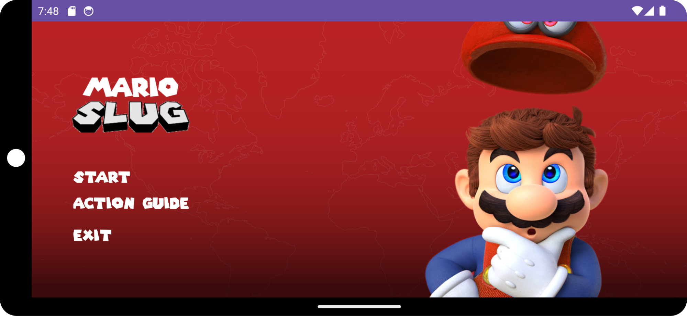
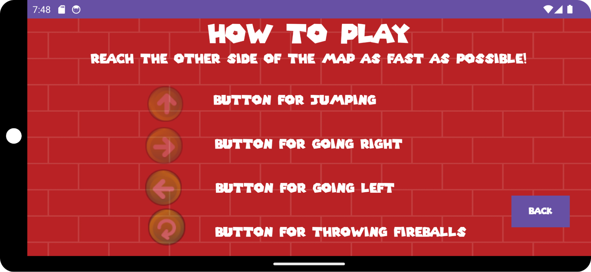
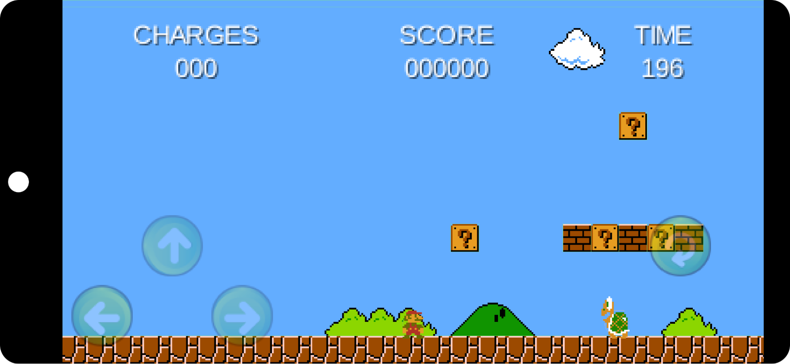
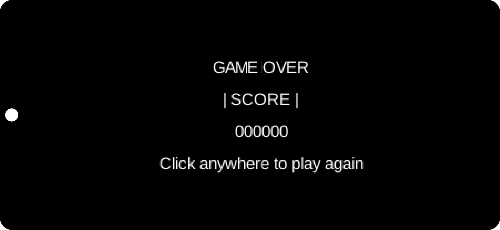
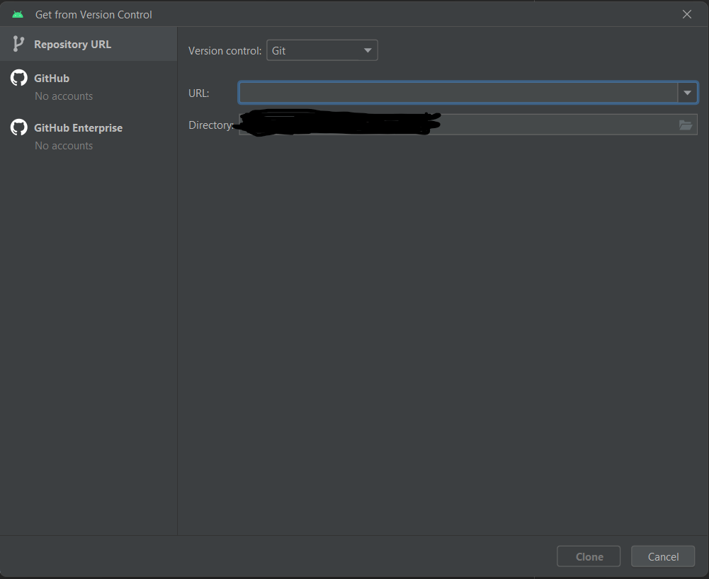

# Mario slug
   
## Description
A Mario game that is that is written in Java with the use of the libGDX framework and the Android Studio IDE.

## Screenshots







## Requirements
- Git (if you want to clone the repository)
- Java SDK 11
- Gradle 7.3.1 or higher
- (For Android/Android Studio emulator) Android SDK 34 to prevent glitches and other issues, but if Android SDK 34 is not available then anything higher than Android SDK 16 should work

## How to install
### ANDROID STUDIO
Open File>New>Project from Version Control
<br />
<br />
Something similar to this tab should show up



<br />

Select git for the version control, select whichever directory you want the project to be in and copy this in the URL section:
```bash
https://github.com/adobong-sunog/mario-slug
```
Click the "Clone" button afterwards
> Note: After cloning and opening the project, a pop-up will appear with options on choosing between "SAFE MODE" or "Trust the project". Safe mode is recommended unless it is needed to trust the project.

### MANUAL INSTALLATION

Clone this repository
```bash
git clone https://github.com/adobong-sunog/mario-slug
```
Then open your preferred IDE and open the project in whichever directory you set it in.
## Acknowledgements
> This project would've been almost impossible to make without [Brent Aureli's](https://github.com/BrentAureli) tutorial

[Brent Aureli's Mario tutorial](https://www.youtube.com/watch?v=a8MPxzkwBwo&list=PLZm85UZQLd2SXQzsF-a0-pPF6IWDDdrXt&index=1), although a slightly outdated tutorial at the time, helped in providing the idea for the base layout of the game. It also provided a decent amount of information on how libGDX works. Big thanks once again to Brent Aureli for providing this tutorial.

> Rest of the resources that have been a massive help in creating this project:
- [libGDX](https://libgdx.com/) (along with its [documentation](https://libgdx.com/wiki/)), a Java game development framework for providing rapid prototyping and fast iterations.
- [Tiled](https://www.mapeditor.org/), a tool that allows for the creation and editing of tiled maps.
- [The Spriters Resource](https://www.spriters-resource.com/), a website containing large amounts of video game sprites
- [ChatGPT](https://chat.openai.com/), a generative chatbot that helped massively in giving ideas and debugging errors in the making of this project.
